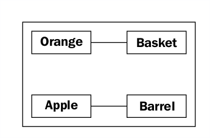
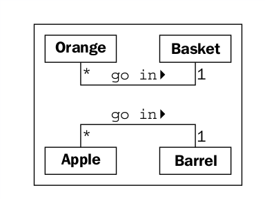

## Objects and classes

Entonces, un objeto es una colección de datos con comportamientos asociados. Como nos diferenciamos
entre tipos de objetos? Las manzanas y las naranjas son objetos, pero es una cosa común.
Adagio de que no se pueden comparar. Las manzanas y las naranjas no se modelan muy a menudo
en programación de computadoras, pero vamos a fingir que estamos haciendo una aplicación de inventario para
una granja frutícola. Para facilitar el ejemplo, podemos asumir que las manzanas van en barriles y
Las naranjas van en cestas.

Ahora, tenemos cuatro tipos de objetos: manzanas, naranjas, canastas y barriles. En
modelado orientado a objetos, el término utilizado para tipo de objeto es clase. Así, en técnica
En términos de términos, ahora tenemos cuatro clases de objetos.

¿Cuál es la diferencia entre un objeto y una clase? Las clases describen objetos. Ellos
Son como planos para crear un objeto. Usted podría tener tres naranjas sentadas en
La mesa frente a ti. Cada naranja es un objeto distinto, pero los tres tienen la
atributos y comportamientos asociados con una clase: la clase general de naranjas.

La relación entre las cuatro clases de objetos en nuestro sistema de inventario puede
ser descrito usando un lenguaje de modelado unificado (invariablemente referido como UML,
porque los acrónimos de tres letras nunca pasan de moda) diagrama de clase. Aquí está nuestra primera
diagrama de clase:

Este diagrama muestra que una Naranja está asociada de alguna manera con una Cesta y que
una manzana también está asociada de alguna manera con un barril. La asociación es la más básica.
Manera para que dos clases estén relacionadas.

UML es muy popular entre los administradores y, en ocasiones, es menospreciado por los programadores.
La sintaxis de un diagrama UML es generalmente bastante obvia; no tienes que leer un
tutorial para (en su mayoría) entender lo que está sucediendo cuando ves uno. UML también es bastante
Fácil de dibujar, y bastante intuitivo. Después de todo, mucha gente, al describir las clases.
y sus relaciones, naturalmente dibujarán cajas con líneas entre ellas. Teniendo
un estándar basado en estos diagramas intuitivos facilita la tarea de los programadores
Comunicarse con diseñadores, gerentes, y entre ellos.

Sin embargo, algunos programadores piensan que UML es una pérdida de tiempo. Citando iterativa
desarrollo, argumentarán que las especificaciones formales se elaboraron en UML de lujo
Los diagramas serán redundantes antes de ser implementados, y eso
mantener estos diagramas formales solo perderá tiempo y no beneficiará a nadie.

Dependiendo de la estructura corporativa involucrada, esto puede o no ser cierto. Sin embargo,
Cada equipo de programación que consiste en más de una persona ocasionalmente tiene que
Siéntese y revise los detalles del subsistema en el que está trabajando. UML es
extremadamente útil en estas sesiones de lluvia de ideas para una comunicación rápida y fácil.
Incluso aquellas organizaciones que se burlan de los diagramas formales de clase tienden a usar algunos informales
Versión de UML en sus reuniones de diseño o discusiones de equipo.

Además, la persona más importante con la que tendrás que comunicarte es
tú mismo. Todos pensamos que podemos recordar las decisiones de diseño que hemos tomado, pero hay
siempre será el ¿Por qué hice eso? Momentos escondidos en nuestro futuro. Si mantenemos el
trozos de papeles hicimos nuestro diagrama inicial cuando comenzamos un diseño,
Eventualmente encontraremos una referencia útil.

Este capítulo, sin embargo, no pretende ser un tutorial en UML. Hay muchos de estos
disponible en Internet, así como numerosos libros disponibles sobre el tema. UML
cubre mucho más que los diagramas de clases y objetos; también tiene una sintaxis para casos de uso,
Implementación, cambios de estado, y actividades. Estaremos tratando con algunos comunes
La sintaxis del diagrama de clase en esta discusión del diseño orientado a objetos. Encontraras eso
Puedes recoger la estructura con el ejemplo y subconscientemente elegirás la
Sintaxis inspirada en UML en tu propio equipo o sesiones de diseño personal.

Nuestro diagrama inicial, aunque correcto, no nos recuerda que las manzanas van en barriles o
en cuántos barriles puede entrar una sola manzana. Solo nos dice que las manzanas son de alguna manera
Asociado a los barriles. La asociación entre clases es a menudo obvia y precisa.
No hay más explicaciones, pero tenemos la opción de agregar más aclaraciones según sea necesario.

La belleza de UML es que la mayoría de las cosas son opcionales. Solo necesitamos especificar como
tanta información en un diagrama como tiene sentido para la situación actual. En un rapido
sesión de pizarra, podríamos dibujar líneas rápidamente entre cajas. En un formal
documento, podríamos entrar en más detalle. En el caso de manzanas y barriles, podemos
Tenga bastante confianza de que la asociación es, muchas manzanas van en un barril, pero solo para
asegúrese de que nadie lo confunda, una manzana estropea un barril, podemos mejorar
el diagrama como se muestra:

Este diagrama nos dice que las naranjas van en canastas con una pequeña flecha que muestra lo que va
en que. También nos dice el número de ese objeto que se puede usar en la asociación en
Ambos lados de la relación. Una cesta puede contener muchos (representados por un *) Naranja
objetos. Cualquier naranja puede ir exactamente en una cesta. Este número se conoce como el
Multiplicidad del objeto. También puedes escucharlo descrito como la cardinalidad. Estos son
en realidad términos ligeramente distintos. La cardinalidad se refiere al número real de elementos en el
conjunto, mientras que la multiplicidad especifica qué tan pequeño o grande podría ser este número.

Frecuentemente olvido de qué lado de una relación continúa la multiplicidad. los
La multiplicidad más cercana a una clase es el número de objetos de esa clase que pueden ser
asociado con cualquier objeto en el otro extremo de la asociación. Para la manzana
va en asociación barril, leyendo de izquierda a derecha, muchos casos de Apple
La clase (es decir, muchos objetos de Apple) puede ir en cualquier barril. Leyendo de derecha a
a la izquierda, exactamente un Barril puede asociarse con cualquier Apple.