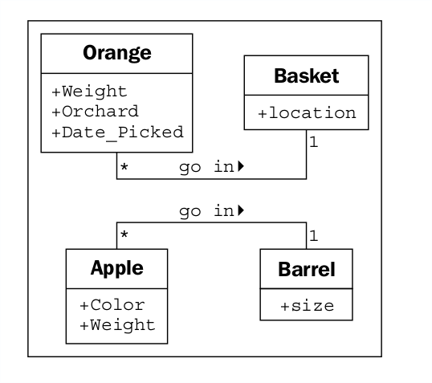
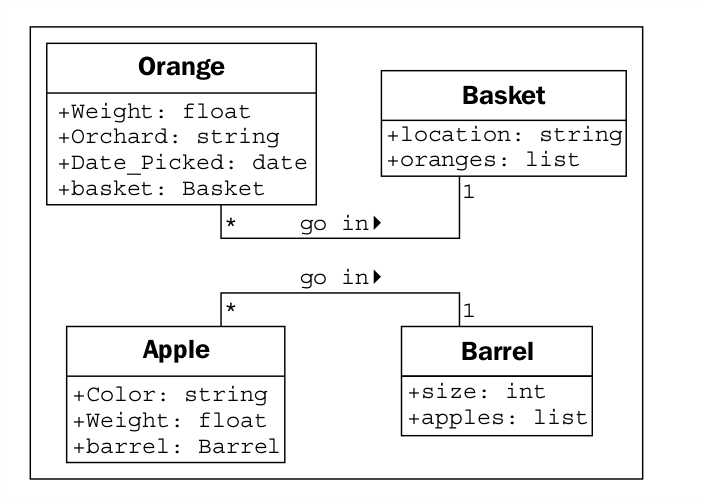

### Data describes objects

Vamos a empezar con los datos. Los datos típicamente representan las características individuales de un
cierto objeto. Una clase puede definir conjuntos específicos de características que son compartidas por todos
objetos de esa clase. Cualquier objeto específico puede tener diferentes valores de datos para el dado
caracteristicas Por ejemplo, nuestras tres naranjas en la mesa (si no hemos comido ninguna)
cada uno podría pesar una cantidad diferente. La clase naranja podría tener un peso.
atributo. Todas las instancias de la clase naranja tienen un atributo de peso, pero cada naranja
tiene un valor diferente para este atributo. Sin embargo, los atributos no tienen que ser únicos; alguna
Dos naranjas pueden pesar la misma cantidad. Como ejemplo más realista, dos objetos.
representar a diferentes clientes podría tener el mismo valor para un atributo de primer nombre.

Los atributos son frecuentemente referidos como miembros o propiedades. Algunos autores
sugiere que los términos tengan significados diferentes, generalmente que los atributos son configurables,
mientras que las propiedades son de solo lectura. En Python, el concepto de "solo lectura" es bastante
No tiene sentido, así que a lo largo de este libro, veremos los dos términos usados ​​indistintamente. En
Además, como veremos en el Capítulo 5, Cuándo usar la programación orientada a objetos, el
La palabra clave de propiedad tiene un significado especial en Python para un tipo particular de atributo.

En nuestra aplicación de inventario de frutas, el productor de frutas puede querer saber qué huerto
La naranja vino, cuando fue recogida, y cuánto pesa. Podrían
También desea realizar un seguimiento de dónde se almacena cada cesta. Las manzanas pueden tener un color
atributo, y los barriles pueden venir en diferentes tamaños. Algunas de estas propiedades pueden
también pertenecen a varias clases (es posible que también queramos saber cuándo se recolectan las manzanas),
pero para este primer ejemplo, solo agreguemos unos cuantos atributos diferentes a nuestro diagrama de clase:

Dependiendo de cuán detallado sea nuestro diseño, también podemos especificar el tipo
para cada atributo. Los tipos de atributos son a menudo primitivos que son estándar para la mayoría
lenguajes de programación, como enteros, números de punto flotante, cadenas, bytes o
Booleano Sin embargo, también pueden representar estructuras de datos como listas, árboles o
Gráficos, o más notablemente, otras clases. Esta es un área donde la etapa de diseño puede
Se superponen con la etapa de programación. Los diversos primitivos u objetos disponibles en
Un lenguaje de programación puede ser algo diferente de lo que está disponible en
otros idiomas.

Por lo general, no necesitamos preocuparnos demasiado por los tipos de datos en la etapa de diseño, ya que
Los detalles específicos de la implementación se eligen durante la etapa de programación. Genérico
Los nombres son normalmente suficientes para el diseño. Si nuestro diseño requiere un tipo de contenedor de lista,
los programadores de Java pueden optar por utilizar una lista enlazada o una lista de arreglos cuando
implementándolo, mientras que los programadores de Python (¡nosotros somos!) pueden elegir entre
Lista incorporada y una tupla.

En nuestro ejemplo de cultivo de frutas hasta ahora, nuestros atributos son todos primitivos básicos. Sin embargo,
Hay algunos atributos implícitos que podemos hacer explícitos: las asociaciones.
Para una naranja dada, podríamos tener un atributo que contenga la cesta que contiene
que naranja

