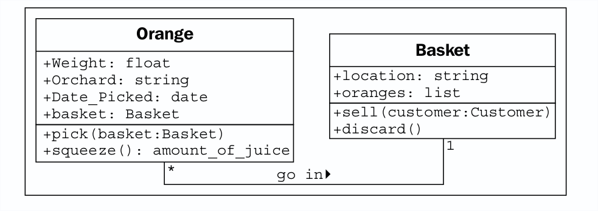

### Behaviors are actions

Ahora, sabemos qué son los datos, pero ¿qué son los comportamientos? Los comportamientos son acciones que
puede ocurrir en un objeto. Los comportamientos que se pueden realizar en una clase específica de
los objetos se llaman metodos A nivel de programación, los métodos son como funciones en
Programación estructurada, pero mágicamente tienen acceso a todos los datos asociados con
este objeto Al igual que las funciones, los métodos también pueden aceptar parámetros y valores de retorno.

Los parámetros de un método son una lista de objetos que deben pasarse al método.
que se está llamando (los objetos que se pasan desde el objeto que llama generalmente son
referidos como argumentos). Estos objetos son utilizados por el método para realizar cualquier
comportamiento o tarea que se supone que haga. Los valores devueltos son el resultado de esa tarea.

Hemos ampliado nuestro ejemplo de "comparación de manzanas y naranjas" en un ejemplo básico (si
Solicitado inventario). Vamos a estirarlo un poco más y ver si se rompe.
Una acción que puede asociarse con naranjas es la acción de selección. Si piensas en
implementación, recoger colocaría la naranja en una canasta actualizando la canasta
atributo de la naranja, y agregando la naranja a la lista de naranjas en la Cesta.
Entonces, Pick necesita saber con qué cesta está lidiando. Hacemos esto dando la selección.
Método de un parámetro de la cesta. Dado que nuestro productor de frutas también vende jugo, podemos agregar un
Método de exprimido a naranja. Cuando se exprime, exprimir puede devolver la cantidad de
jugo recuperado, mientras que también quita la naranja de la canasta en la que estaba.

La cesta puede tener una acción de venta. Cuando se vende una canasta, nuestro sistema de inventario.
podría actualizar algunos datos sobre objetos aún no especificados para contabilidad y ganancias
cálculos Alternativamente, nuestra canasta de naranjas podría deteriorarse antes de que podamos vender
ellos, por lo que añadimos un método de descarte. Agreguemos estos métodos a nuestro diagrama:

Agregar modelos y métodos a objetos individuales nos permite crear un sistema de
objetos que interactúan. Cada objeto en el sistema es un miembro de una cierta clase. Estas
las clases especifican qué tipos de datos puede contener el objeto y qué métodos pueden ser
invocado en ello. Los datos en cada objeto pueden estar en un estado diferente de otros objetos
de la misma clase, y cada objeto puede reaccionar a las llamadas de método de manera diferente debido a
Las diferencias de estado.

El análisis y diseño orientados a objetos se trata de descubrir qué son esos objetos
y cómo deben interactuar. La siguiente sección describe los principios que se pueden utilizar.
para hacer esas interacciones lo más simples e intuitivas posible.