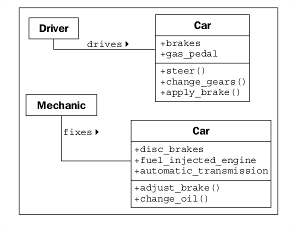

### Hiding details and creating the public interface

El propósito clave de modelar un objeto en un diseño orientado a objetos es determinar qué
La interfaz pública de ese objeto será. La interfaz es la colección de atributos.
y métodos que otros objetos pueden usar para interactuar con ese objeto. Ellos no necesitan,
y con frecuencia no están permitidos, para acceder al funcionamiento interno del objeto. Una común
Ejemplo del mundo real es la televisión. Nuestra interfaz para la televisión es el mando a distancia.
controlar. Cada botón en el control remoto representa un método que puede ser llamado en
El objeto de la televisión. Cuando nosotros, como objeto llamante, accedemos a estos métodos, no
saber o preocuparse si el televisor está recibiendo su señal de una antena, una conexión por cable,
o una antena parabólica. No nos importa qué señales electrónicas se envían para ajustar la
volumen, o si el sonido está destinado a altavoces o auriculares. Si abrimos el
televisión para acceder al funcionamiento interno, por ejemplo, para dividir la señal de salida a
Tanto los altavoces externos como los auriculares, anularemos la garantía.

Este proceso de ocultar la implementación, o detalles funcionales, de un objeto es
adecuadamente llamado ocultamiento de información. También a veces se le conoce como encapsulación,
pero la encapsulación es en realidad un término que lo abarca todo. Los datos encapsulados son
No necesariamente escondido. La encapsulación es, literalmente, crear una cápsula y así pensar
de crear una cápsula del tiempo. Si pones un montón de información en una cápsula del tiempo,
Cerrarlo y enterrarlo, está encapsulado y la información está oculta. En el otro
mano, si la cápsula del tiempo no ha sido enterrada y está desbloqueada o hecha de forma transparente
De plástico, los elementos en su interior todavía están encapsulados, pero no hay información oculta.

La distinción entre encapsulación y ocultación de información es en gran parte
irrelevante, especialmente a nivel de diseño. Muchas referencias prácticas utilizan estos términos.
indistintamente Como programadores de Python, en realidad no tenemos ni necesitamos verdad.
información oculta, (discutiremos las razones de esto en el Capítulo 2, Objetos en
Python), por lo que la definición más abarcadora para la encapsulación es adecuada.

La interfaz pública, sin embargo, es muy importante. Necesita ser cuidadosamente diseñado
Como es difícil cambiarlo en el futuro. Cambiar la interfaz romperá cualquier cliente
Objetos que lo están llamando. Podemos cambiar los internos todo lo que nos gusta, por ejemplo, para
haga que sea más eficiente, o para acceder a los datos a través de la red, así como a nivel local, y
Los objetos del cliente todavía podrán hablar con él, sin modificar, utilizando la interfaz pública.
Por otro lado, si cambiamos la interfaz cambiando los nombres de atributo que son
de acceso público, o alterando el orden o los tipos de argumentos que un método puede
aceptar, todos los objetos del cliente también tendrán que ser modificados. Mientras que en el tema de público
interfaces, que sea sencillo. Diseñe siempre la interfaz de un objeto en función de lo fácil que sea.
es para usar, no lo difícil que es codificar (este consejo también se aplica a las interfaces de usuario).

Recuerde, los objetos del programa pueden representar objetos reales, pero eso no hace
Los objetos reales. Son modelos Uno de los mayores dones del modelaje es el
Habilidad para ignorar detalles irrelevantes. El modelo de coche que construí de niño puede parecer un
Thunderbird real de 1956 en el exterior, pero no funciona y el eje de transmisión no lo hace
giro. Estos detalles eran demasiado complejos e irrelevantes antes de comenzar a conducir.
El modelo es una abstracción de un concepto real.

La abstracción es otro concepto orientado a objetos relacionado con la encapsulación y
ocultación de información. En pocas palabras, la abstracción significa tratar con el nivel de detalle
eso es lo más apropiado para una tarea dada. Es el proceso de extracción de un público.
Interfaz desde los detalles internos. Un conductor de un automóvil necesita interactuar con la dirección,
pedal de gas, y frenos. El funcionamiento del motor, el tren de accionamiento y el subsistema de frenos.
no le importa al conductor Un mecánico, por otro lado, trabaja a un nivel diferente.
De abstracción, afinando el motor y desangrando las roturas. Aquí hay un ejemplo de dos
Niveles de abstracción para un coche:

Ahora, tenemos varios términos nuevos que se refieren a conceptos similares. Condensando todo
esta jerga en un par de oraciones: la abstracción es el proceso de encapsulación
Información con interfaces públicas y privadas separadas. Las interfaces privadas pueden
estar sujeto a la ocultación de información.

La lección importante que debemos extraer de todas estas definiciones es hacer que nuestros modelos
Comprensible a otros objetos que tienen que interactuar con ellos. Esto significa pagar
Atención cuidadosa a pequeños detalles. Asegúrese de que los métodos y propiedades tengan nombres sensibles.
Al analizar un sistema, los objetos normalmente representan sustantivos en el problema original,
mientras que los métodos son normalmente verbos. Los atributos a menudo se pueden recoger como adjetivos,
aunque si el atributo se refiere a otro objeto que forma parte del objeto actual,
todavía es probable que sea un sustantivo. Nombre clases, atributos y métodos en consecuencia.

No intente modelar objetos o acciones que puedan ser útiles en el futuro. Modelo exactamente
aquellas tareas que el sistema necesita realizar, y el diseño naturalmente gravitará
Hacia el que tiene un nivel de abstracción adecuado. Esto no quiere decir que nosotros
No debe pensar en posibles modificaciones futuras de diseño. Nuestros diseños deben ser
Abierto para que los requisitos futuros puedan ser satisfechos. Sin embargo, al abstraer
interfaces, intente modelar exactamente lo que necesita ser modelado y nada más.

Al diseñar la interfaz, intente colocarse en los zapatos del objeto e imagine
Que el objeto tiene una fuerte preferencia por la privacidad. No permitas que otros objetos tengan acceso.
a datos sobre usted, a menos que sienta que es lo mejor para usted que lo tengan. No hacer
Dales una interfaz para obligarte a realizar una tarea específica a menos que estés seguro.
Quieres que te puedan hacer eso.

