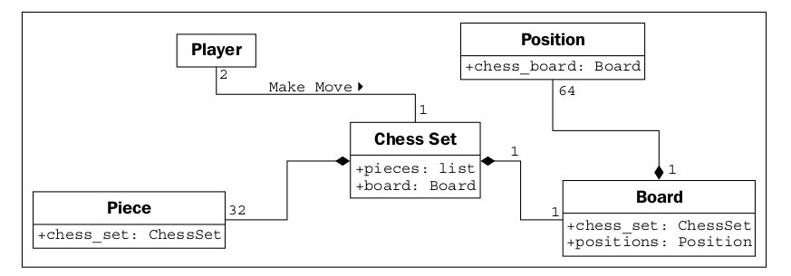

### Composition

Hasta ahora, aprendimos a diseñar sistemas como un grupo de objetos interactivos, donde cada uno
la interacción implica ver objetos en un nivel apropiado de abstracción. Pero nosotros
No sé todavía cómo crear estos niveles de abstracción. Hay una variedad de formas
para hacer esto; Discutiremos algunos patrones de diseño avanzados en el Capítulo 8, Cadenas y
Serialización y Capítulo 9, El Patrón Iterador. Pero incluso la mayoría de los patrones de diseño dependen
en dos principios básicos orientados a objetos conocidos como composición y herencia.
La composición es más simple, así que vamos a empezar con ella.

La composición es el acto de reunir varios objetos juntos para crear uno nuevo.
La composición suele ser una buena opción cuando un objeto es parte de otro objeto.
Ya hemos visto un primer indicio de composición en el ejemplo mecánico. Un carro es
compuesto por un motor, transmisión, arranque, faros y parabrisas, entre
numerosas otras partes. El motor, a su vez, está compuesto de pistones, un cigüeñal y
valvulas En este ejemplo, la composición es una buena manera de proporcionar niveles de abstracción.
El objeto de automóvil puede proporcionar la interfaz requerida por un conductor, al mismo tiempo que proporciona
Acceso a sus componentes, que ofrece el nivel más profundo de abstracción adecuado
para un mecanico. Esas partes componentes pueden, por supuesto, desglosarse aún más si el
El mecánico necesita más información para diagnosticar un problema o ajustar el motor.

Este es un ejemplo introductorio común de composición, pero no es demasiado útil
Cuando se trata de diseñar sistemas informáticos. Los objetos físicos son fáciles de romper
en objetos componentes. La gente ha estado haciendo esto al menos desde los antiguos griegos.
originalmente postuló que los átomos eran las unidades más pequeñas de materia (ellos, por supuesto,
No tenía acceso a los aceleradores de partículas). Los sistemas informáticos son generalmente menos
Más complicado que los objetos físicos, pero identificando los objetos componentes en tales
Los sistemas no ocurren tan naturalmente.

Los objetos en un sistema orientado a objetos ocasionalmente representan objetos físicos tales
Como personas, libros, o teléfonos. Más a menudo, sin embargo, representan ideas abstractas.
Las personas tienen nombres, los libros tienen títulos y los teléfonos se usan para hacer llamadas. Llamadas,
Los títulos, cuentas, nombres, citas y pagos generalmente no se consideran
objetos en el mundo físico, pero todos son componentes modelados frecuentemente en
sistemas informaticos

Intentemos modelar un ejemplo más orientado a la computadora para ver la composición en
acción. Estaremos viendo el diseño de un juego de ajedrez computarizado. Esta fue una
Pasatiempo muy popular entre los académicos en los años 80 y 90. La gente predecía
que las computadoras algún día pudieran derrotar a un maestro de ajedrez humano. Cuando
esto sucedió en 1997 (el campeón mundial de ajedrez derrotado Deep Blue de IBM, Gary
Kasparov), el interés en el problema se desvaneció, aunque todavía hay concursos entre
Jugadores informáticos y de ajedrez humano. (Las computadoras suelen ganar.)

Como análisis básico de alto nivel, un juego de ajedrez se juega entre dos jugadores,
utilizando un juego de ajedrez con un tablero que contiene sesenta y cuatro posiciones en una cuadrícula de 8 x 8.
El tablero puede tener dos juegos de dieciséis piezas que se pueden mover, alternativamente
Gira por los dos jugadores de diferentes maneras. Cada pieza puede tomar otras piezas. los
Se requerirá que el tablero se dibuje en la pantalla de la computadora después de cada turno.

He identificado algunos de los objetos posibles en la descripción usando cursivas, y algunos
Métodos clave utilizando negrita. Este es un primer paso común para convertir un objeto orientado a objetos.
Análisis en un diseño. En este punto, para enfatizar la composición, nos centraremos en el
Tablero, sin preocuparse demasiado por los jugadores o los diferentes tipos de piezas.

Empecemos por el más alto nivel de abstracción posible. Tenemos dos jugadores
interactuando con un juego de ajedrez tomando turnos haciendo movimientos:

¿Que es esto? No se parece mucho a nuestros diagramas de clase anteriores. Eso es porque
¡No es un diagrama de clase! Este es un diagrama de objetos, también llamado diagrama de instancia. Eso
describe el sistema en un estado específico en el tiempo y describe instancias específicas
De objetos, no la interacción entre clases. Recuerda, ambos jugadores son miembros.

El diagrama muestra que exactamente dos jugadores pueden interactuar con un juego de ajedrez. También
indica que cualquier jugador puede jugar con un solo juego de ajedrez a la vez.

Sin embargo, estamos discutiendo la composición, no UML, así que pensemos en lo que
El juego de ajedrez está compuesto por. No nos importa de qué se compone el jugador en este momento.
Podemos suponer que el jugador tiene un corazón y un cerebro, entre otros órganos, pero estos
Son irrelevantes para nuestro modelo. De hecho, no hay nada que impida que dicho jugador sea
El mismo Deep Blue, que no tiene ni corazón ni cerebro.

El juego de ajedrez, entonces, está compuesto por un tablero y 32 piezas. El tablero mas alla
Comprende 64 posiciones. Se podría argumentar que las piezas no son parte del juego de ajedrez.
Porque podrías reemplazar las piezas en un juego de ajedrez con un juego diferente de piezas.
Si bien esto es improbable o imposible en una versión computarizada de ajedrez, introduce
A la agregación.

La agregación es casi exactamente como la composición. La diferencia es que el agregado
Los objetos pueden existir independientemente. Sería imposible asociar una posición.
con un tablero de ajedrez diferente, por lo que decimos que el tablero está compuesto de posiciones. Pero el
Las piezas, que pueden existir independientemente del conjunto de ajedrez, se dice que están en un agregado
relación con ese conjunto.

Otra forma de diferenciar entre agregación y composición es pensar en
La vida útil del objeto. Si el objeto compuesto (exterior) controla cuando el relacionado
(adentro) los objetos son creados y destruidos, la composición es la más adecuada. Si el relacionado
el objeto se crea independientemente del objeto compuesto, o puede durar más que ese objeto,
Una relación agregada tiene más sentido. Además, ten en cuenta que la composición.
es agregacion La agregación es simplemente una forma más general de composición. Alguna
La relación compuesta es también una relación agregada, pero no al revés.

Vamos a describir nuestra actual composición de juegos de ajedrez y agregar algunos atributos a la
Objetos para mantener las relaciones compuestas:

La relación de composición se representa en UML como un diamante sólido. El hueco
El diamante representa la relación agregada. Notarás que el tablero y
las piezas se almacenan como parte del juego de ajedrez exactamente de la misma manera que una referencia a ellas
se almacena como un atributo en el juego de ajedrez. Esto demuestra que, una vez más, en la práctica,
la distinción entre agregación y composición es a menudo irrelevante una vez que
Pasar la etapa de diseño. Cuando se implementan, se comportan de la misma manera.
Sin embargo, puede ayudar a diferenciar entre los dos cuando su equipo está discutiendo
Cómo interactúan los diferentes objetos. A menudo, puedes tratarlos como lo mismo, pero
cuando necesite distinguirlos, es bueno saber la diferencia (esto
es la abstracción en el trabajo).

