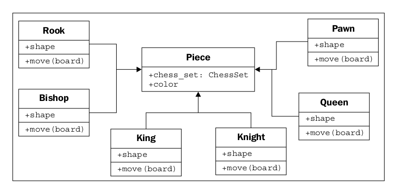

## Inheritance

Discutimos tres tipos de relaciones entre objetos: asociación, composición,
y la agregación. Sin embargo, no hemos especificado completamente nuestro juego de ajedrez, y estas herramientas
No parece que nos den todo el poder que necesitamos. Discutimos la posibilidad de que un jugador
podría ser un humano o podría ser una pieza de software con inteligencia artificial. Eso
No parece correcto decir que un jugador está asociado con un humano, o que lo artificial
La implementación de la inteligencia es parte del objeto jugador. Lo que realmente necesitamos es el
capacidad para decir que "Deep Blue es un jugador" o que "Gary Kasparov es un jugador".

El es una relación que se forma por herencia. La herencia es la más famosa, bien
Relación conocida y sobreutilizada en la programación orientada a objetos. La herencia es de tipo
de como un árbol genealógico. El apellido de mi abuelo era Phillips y mi padre heredó
ese nombre. Lo heredé de él (junto con los ojos azules y una inclinación por la escritura).
En la programación orientada a objetos, en lugar de heredar características y comportamientos de un
persona, una clase puede heredar atributos y métodos de otra clase.

Por ejemplo, hay 32 piezas de ajedrez en nuestro juego de ajedrez, pero solo hay seis diferentes
tipos de piezas (peones, torres, obispos, caballeros, rey y reina), cada uno de los cuales
Se comporta de manera diferente cuando se mueve. Todas estas clases de pieza tienen propiedades,
como el color y el juego de ajedrez del que forman parte, pero también tienen formas únicas
Cuando se dibuja en el tablero de ajedrez, y realiza diferentes movimientos. Vamos a ver cómo son las seis.
Los tipos de piezas pueden heredar de una clase de pieza:

Las flechas huecas indican que las clases individuales de piezas heredan de la pieza.
clase. Todos los subtipos tienen automáticamente un atributo chess_set y color heredado
de la clase base. Cada pieza proporciona una propiedad de forma diferente (que se dibujará en la
pantalla al renderizar el tablero), y un método de movimiento diferente para mover la pieza a una
Nueva posición en el tablero en cada turno.

En realidad, sabemos que todas las subclases de la clase Piece deben tener un método de movimiento;
de lo contrario, cuando el tablero intente mover la pieza, se confundirá. Es posible
que nos gustaría crear una nueva versión del juego de ajedrez que tiene uno
Pieza adicional (el asistente). Nuestro diseño actual nos permite diseñar esta pieza.
Sin darle un método de movimiento. El tablero entonces se ahogaría cuando preguntaba al
Pieza para moverse.

Podemos implementar esto creando un método de movimiento ficticio en la clase Piece. los
Las subclases pueden anular este método con una implementación más específica. los
la implementación predeterminada puede, por ejemplo, mostrar un mensaje de error que dice: Eso
La pieza no se puede mover.

Los métodos de sustitución en subtipos permiten que los sistemas muy potentes orientados a objetos
ser desarrollado. Por ejemplo, si quisiéramos implementar una clase de jugador con artificial
inteligencia, podríamos proporcionar un método de cálculo de movimiento que toma un objeto Board
y decide qué pieza mover hacia dónde. Una clase muy básica podría elegir al azar
Una pieza y dirección y moverla en consecuencia. Entonces podríamos anular este método
en una subclase con la implementación Deep Blue. La primera clase sería adecuada.
para jugar contra un principiante en bruto, este último desafiaría a un gran maestro. los
Lo importante es que otros métodos en la clase, como los que informan al
El tablero en cuanto a qué movimiento fue elegido no necesita ser cambiado; esta implementación puede
Se compartirá entre las dos clases.

En el caso de las piezas de ajedrez, no tiene sentido proporcionar un valor predeterminado.
Implementación del método de movimiento. Todo lo que tenemos que hacer es especificar que el movimiento
El método es requerido en cualquier subclase. Esto se puede hacer haciendo a Piece un resumen.
Clase con el método de movimiento declarado abstracto. Los métodos abstractos básicamente dicen: "Nosotros
Exija que este método exista en cualquier subclase no abstracta, pero estamos declinando a
especifique una implementación en esta clase ".

De hecho, es posible hacer una clase que no implemente ningún método. Tal
una clase simplemente nos dirá lo que debe hacer la clase, pero no proporciona absolutamente nada.
Consejos sobre cómo hacerlo. En el lenguaje orientado a objetos, estas clases se llaman interfaces.