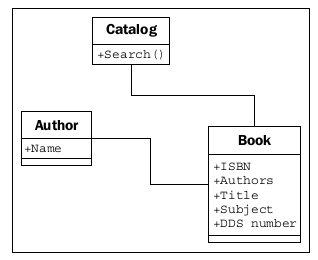
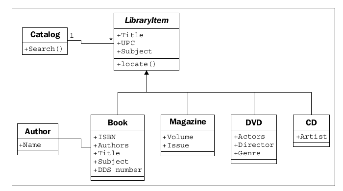
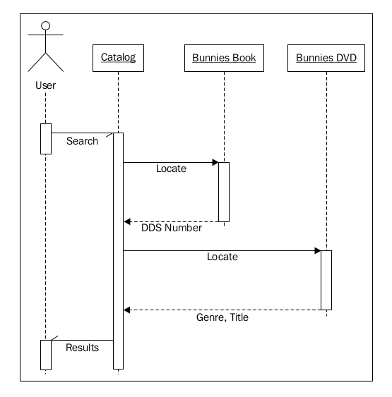
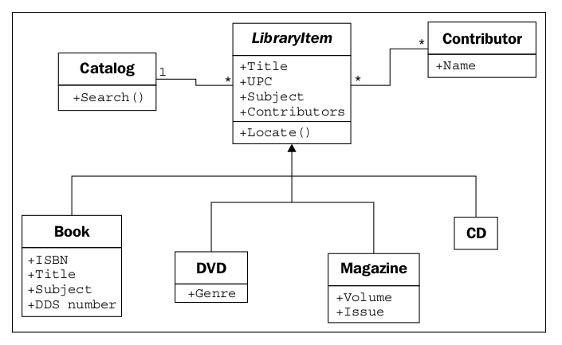
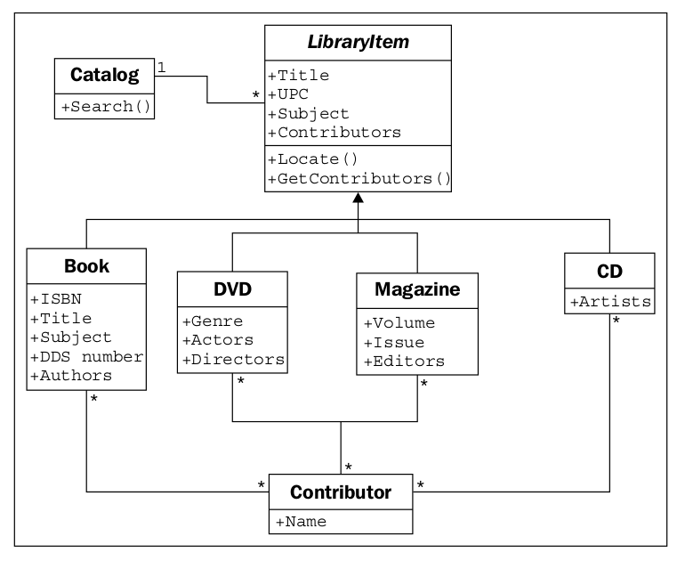
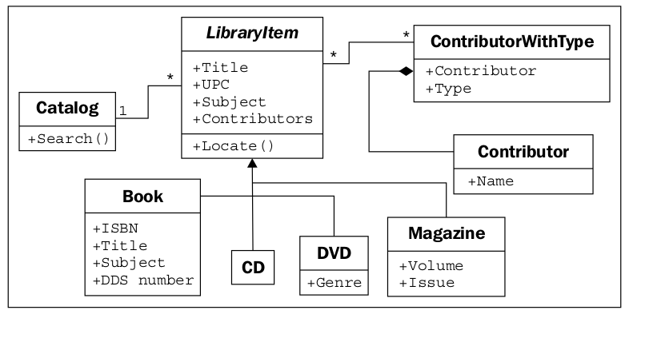

## Case of Study

Unamos todos nuestros nuevos conocimientos orientados a objetos, pasando por algunos
iteraciones de diseño orientado a objetos en un ejemplo del mundo real. El sistema
Estaremos modelando es un catálogo de la biblioteca. Las bibliotecas han estado siguiendo su inventario para
siglos, originalmente utilizando catálogos de tarjetas, y más recientemente, inventarios electrónicos.
Las bibliotecas modernas tienen catálogos basados ​​en la web que podemos consultar desde nuestros hogares.

Empecemos con un análisis. El bibliotecario local nos ha pedido que escribamos una nueva tarjeta.
programa de catálogo porque su antiguo programa basado en DOS es feo y está desactualizado.
Eso no nos da muchos detalles, pero antes de comenzar a solicitar más información,
Consideremos lo que ya sabemos sobre los catálogos de bibliotecas.

Los catálogos contienen listas de libros. La gente los busca para encontrar libros sobre ciertos temas,
con títulos específicos, o por un autor en particular. Los libros pueden ser identificados únicamente por un
Número de libro estándar internacional (ISBN). Cada libro tiene un decimal de Dewey.
Número de sistema (DDS) asignado para ayudar a encontrarlo en un estante particular.

Este simple análisis nos dice algunos de los objetos obvios en el sistema. Nosotros rapidamente
Identificar libro como el objeto más importante, con varios atributos ya
mencionados, como el autor, el título, el tema, el ISBN y el número DDS, y el catálogo como
Una especie de gerente de libros.

También notamos algunos otros objetos que pueden o no necesitar ser modelados en el
sistema. Para propósitos de catalogación, todo lo que necesitamos para buscar un libro por autor es un autor_
Nombre del atributo en el libro. Sin embargo, los autores también son objetos, y podríamos querer
almacenar algunos otros datos sobre el autor. Mientras reflexionamos sobre esto, podemos recordar que
Algunos libros tienen varios autores. De repente, la idea de tener un solo autor nombre.
atribuir a los objetos parece un poco tonto. Una lista de autores asociados con cada libro es
claramente una mejor idea

La relación entre el autor y el libro es claramente una asociación, ya que
nunca diga "un libro es un autor" (no es herencia), y decir "un libro tiene una
autor ", aunque gramaticalmente correcto, no implica que los autores sean parte de libros
(No es agregación). De hecho, cualquier autor puede estar asociado con varios libros.

También debemos prestar atención al sustantivo (los sustantivos son siempre buenos candidatos para
objetos) estante. ¿Es un estante un objeto que necesita ser modelado en un sistema de catalogación?
¿Cómo identificamos un estante individual? ¿Qué pasa si un libro se almacena en la
final de un estante, y luego se trasladó al comienzo del siguiente estante porque otro
libro fue insertado en el estante anterior?

DDS fue diseñado para ayudar a localizar libros físicos en una biblioteca. Como tal, almacenando un
El atributo DDS con el libro debería ser suficiente para ubicarlo, independientemente de qué estante
se almacena en. Así podemos, al menos por el momento, eliminar el estante de nuestra lista de
objetos contendientes.

Otro objeto cuestionable en el sistema es el usuario. Necesitamos saber algo
acerca de un usuario específico, como su nombre, dirección o lista de libros vencidos? Hasta ahora, el
El bibliotecario solo nos ha dicho que quieren un catálogo; no dijeron nada sobre el seguimiento
Suscripciones o avisos de vencimiento. En el fondo de nuestras mentes, también observamos que los autores
y los usuarios son tipos específicos de personas; podría haber una herencia útil
relación aquí en el futuro.

Para propósitos de catalogación, decidimos que no necesitamos identificar al usuario por ahora. Nosotros
Puede asumir que un usuario buscará en el catálogo, pero no tenemos que hacerlo activamente.
Modelarlos en el sistema, más allá de proporcionar una interfaz que les permita buscar.

Hemos identificado algunos atributos en el libro, pero ¿qué propiedades tiene un catálogo?
¿tener? ¿Alguna biblioteca tiene más de un catálogo? ¿Necesitamos únicamente
identificarlos? Obviamente, el catálogo debe tener una colección de los libros que
contiene, de alguna manera, pero esta lista probablemente no sea parte de la interfaz pública.

¿Qué pasa con los comportamientos? El catálogo claramente necesita un método de búsqueda, posiblemente separado
Los de autores, títulos y asignaturas. ¿Hay algún comportamiento en los libros? Verdad
¿Necesita un método de vista previa? O podría ser vista previa identificada por un atributo de primeras páginas
en lugar de un método?

Las preguntas en la discusión anterior son todas parte del análisis orientado a objetos.
fase. Pero entremezclado con las preguntas, ya hemos identificado algunas claves
Objetos que forman parte del diseño. De hecho, lo que acabas de ver son varios
Microiteraciones entre análisis y diseño.

Probablemente, estas iteraciones se producirían en una reunión inicial con el bibliotecario. antes de
En esta reunión, sin embargo, ya podemos esbozar un diseño más básico para los objetos.
Hemos identificado concretamente:

Armados con este diagrama básico y un lápiz para mejorarlo interactivamente, nos encontramos con
con el bibliotecario. Nos dicen que este es un buen comienzo, pero las bibliotecas no sirven
solo libros, también tienen DVD, revistas y CD, ninguno de los cuales tiene un ISBN
o número DDS. Todos estos tipos de artículos pueden ser identificados de manera única por una UPC
número sin embargo. Recordamos a la bibliotecaria que tienen que encontrar los elementos en el
estante, y estos elementos probablemente no están organizados por la UPC. El bibliotecario explica que
Cada tipo está organizado de una manera diferente. Los CD son en su mayoría libros de audio, y
solo tienen un par de docenas en stock, por lo que están organizados por el apellido del autor.
Los DVD se dividen en género y se organizan por título. Se organizan revistas
por título y luego refinado por el volumen y número de emisión. Los libros son, como los teníamos.
adivinado, organizado por el número DDS.

Sin experiencia previa en diseño orientado a objetos, podríamos considerar agregar
Separe listas de DVD, CD, revistas y libros en nuestro catálogo, y busque cada uno
uno a su vez. El problema es, a excepción de ciertos atributos extendidos, y la identificación de
Ubicación física del elemento, todos estos elementos se comportan de la misma manera. Este es un trabajo
por herencia! Actualizamos rápidamente nuestro diagrama UML:

El bibliotecario entiende la esencia de nuestro diagrama esbozado, pero está un poco confundido por la
Localizar la funcionalidad. Explicamos usando un caso de uso específico donde el usuario está buscando.
por la palabra "conejitos". El usuario primero envía una solicitud de búsqueda al catálogo. El catalogo
consulta su lista interna de artículos y encuentra un libro y un DVD con "conejitos" en el título.
En este punto, al catálogo no le importa si tiene un DVD, libro, CD o revista; todos
Los artículos son los mismos, en lo que respecta al catálogo. Sin embargo, el usuario quiere saber.
cómo encontrar los elementos físicos, por lo que el catálogo sería negligente si simplemente devolviera un
Lista de títulos. Por lo tanto, llama al método de localización en los dos elementos que ha descubierto. Los libros
El método de localización devuelve un número DDS que se puede usar para encontrar el estante que contiene el
libro. El DVD se encuentra devolviendo el género y el título del DVD. El usuario puede
luego visite la sección de DVD, busque la sección que contiene ese género y encuentre la específica
DVD ordenado por los títulos.

Como explicamos, esbozamos un diagrama de secuencia UML que explica cómo los diversos
Los objetos se están comunicando:

Donde, diagramas de clase describen las relaciones entre clases, y secuencia
Los diagramas describen secuencias específicas de mensajes pasados ​​entre objetos. El guión
la línea que cuelga de cada objeto es una línea de vida que describe la vida útil del objeto. los
los cuadros más anchos en cada línea de vida representan el procesamiento activo en ese objeto (donde hay
no hay caja, el objeto está básicamente sentado inactivo, esperando que algo suceda). los
Las flechas horizontales entre las líneas de vida indican mensajes específicos. Las flechas solidas
representan los métodos que se llaman, mientras que las flechas discontinuas con cabezas sólidas representan
El método devuelve valores.

La mitad de las puntas de flecha indican mensajes asíncronos enviados ao desde un objeto. Un
mensaje asíncrono generalmente significa que el primer objeto llama a un método en el segundo
Objeto, que devuelve inmediatamente. Después de algún procesamiento, el segundo objeto llama a
Método en el primer objeto para darle un valor. Esto está en contraste con el método normal
Llamadas, que realizan el procesamiento en el método y devuelven un valor inmediatamente.

Los diagramas de secuencia, como todos los diagramas UML, se utilizan mejor solo cuando son
necesario. No tiene sentido dibujar un diagrama UML por dibujar
un diagrama. Sin embargo, cuando necesitas comunicar una serie de interacciones.
Entre dos objetos, el diagrama de secuencia es una herramienta muy útil.

Desafortunadamente, nuestro diagrama de clase hasta ahora sigue siendo un diseño desordenado. Notamos que los actores.
en DVD y los artistas en CD son todo tipo de personas, pero se les trata de manera diferente
De los autores del libro. El bibliotecario también nos recuerda que la mayoría de sus CDs son
Audiolibros, que tienen autores en lugar de artistas.

¿Cómo podemos tratar con diferentes tipos de personas que contribuyen a un título? Un obvio
implementación es crear una clase de Persona con el nombre de la persona y otra información relevante.
detalles, y luego crear subclases de esto para los artistas, autores y actores. Sin embargo,
¿Es realmente necesaria la herencia aquí? Para fines de búsqueda y catalogación, no
Realmente me importa que la actuación y la escritura sean dos actividades muy diferentes. Si estuviéramos haciendo
una simulación económica, tendría sentido dar clases separadas de actor y autor,
y diferentes métodos de cálculo de entrada y de ejecución, pero para la catalogación
Para propósitos, probablemente sea suficiente saber cómo contribuyó la persona al artículo.
Reconocemos que todos los elementos tienen uno o más objetos Colaboradores, por lo que movemos el
Relación del autor desde el libro hasta su clase padre:

La multiplicidad de la relación Contribuidor / LibraryItem es de muchos a muchos, como
indicado por el carácter * en ambos extremos de una relación. Cualquier artículo de la biblioteca
podría tener más de un colaborador (por ejemplo, varios actores y un director
en un DVD). Y muchos autores escriben muchos libros, por lo que se adjuntan a
múltiples elementos de la biblioteca.

Este pequeño cambio, aunque se ve un poco más limpio y simple, ha perdido algo de vital importancia.
información. Todavía podemos decir quién contribuyó a un artículo de biblioteca específico, pero no lo hacemos
saber como contribuyeron ¿Fueron ellos el director o un actor? ¿Escribieron el
¿Libro de audio, o fueron la voz que narró el libro?

Sería bueno si pudiéramos simplemente agregar un atributo contributor_type en el
Clase contribuyente, pero esto se derrumbará cuando se trate de personas con múltiples talentos
Que han escrito libros y han dirigido películas.

Una opción es agregar atributos a cada una de nuestras subclases de LibraryItem que contienen el
la información que necesitamos, como Autor en libro o Artista en CD, y luego realice la
relación a esas propiedades todas apuntan a la clase Contribuidor. El problema con
Es que perdemos mucha elegancia polimórfica. Si queremos listar los contribuyentes a
un elemento, tenemos que buscar atributos específicos en ese elemento, como Autores o Actores.
Podemos aliviar esto agregando un método GetContributors en la clase LibraryItem
que las subclases pueden anular. Entonces el catálogo nunca tiene que saber qué atributos tiene.
los objetos están consultando; hemos abstraído la interfaz pública:

Con solo mirar este diagrama de clase, parece que estamos haciendo algo mal. Es
abultado y frágil. Puede hacer todo lo que necesitamos, pero parece que será difícil
mantener o extender. Hay demasiadas relaciones y demasiadas clases
ser afectado por modificaciones a cualquier clase. Parece espaguetis y albóndigas.

Ahora que hemos explorado la herencia como una opción, y encontramos que faltaba, podríamos
mire hacia atrás a nuestro diagrama anterior basado en composición, donde Colaborador fue
adjunto directamente a LibraryItem. Con un poco de pensamiento, podemos ver que en realidad
solo es necesario agregar una relación más a una clase nueva para identificar el tipo de
contribuyente. Este es un paso importante en el diseño orientado a objetos. Ahora estamos agregando un
clase para el diseño que está destinado a soportar los otros objetos, en lugar de modelar
Cualquier parte de los requisitos iniciales. Estamos refactorizando el diseño para facilitar la
Objetos en el sistema, en lugar de objetos en la vida real. La refactorización es un proceso esencial.
En el mantenimiento de un programa o diseño. El objetivo de la refactorización es mejorar la
diseñe moviendo el código, eliminando el código duplicado o las relaciones complejas en
Favor de diseños más simples, más elegantes.

Esta nueva clase está compuesta por un contribuidor y un atributo adicional que identifica
el tipo de contribución que la persona ha hecho al artículo de biblioteca dado. Allí pueden
ser muchas tales contribuciones a un LibraryItem particular, y un contribuyente puede
Contribuye de la misma manera a diferentes artículos. El diagrama comunica esto.
diseño muy bien:

Al principio, esta relación de composición parece menos natural que la basada en la herencia.
relaciones Sin embargo, tiene la ventaja de permitirnos agregar nuevos tipos de
Contribuciones sin añadir una nueva clase al diseño. La herencia es más útil.
Cuando las subclases tienen algún tipo de especialización. La especialización está creando.
o cambiar atributos o comportamientos en la subclase para hacerlo de alguna manera diferente
de la clase padre. Parece tonto crear un montón de clases vacías únicamente para
identificar diferentes tipos de objetos (esta actitud es menos frecuente entre Java y
Otros programadores de "todo es un objeto", pero es común entre los más prácticos.
Diseñadores de Python). Si nos fijamos en la versión de herencia del diagrama, podemos ver una
Un montón de subclases que en realidad no hacen nada:

